# Architecture-Compliant Section Sync Solution

## The Problem with the Previous Fix

The previous implementation violated several architectural principles:

### ❌ **Violations**:
1. **Global Object Sniffing**: `window.sectionLayoutManager` accessed directly
2. **Cross-System Manipulation**: State manager directly modifying SectionLayoutManager's internal Map
3. **Tight Coupling**: Systems directly dependent on each other's internals
4. **Not Event-Driven**: Direct method calls instead of events

## ✅ **The Simpler, Compliant Solution**

### Core Principle: Single Source of Truth + Event-Driven Updates

```
State (Source of Truth) → Event → Manager (Mirror) → Event → Renderer (Display)
```

### Implementation:

#### 1. **State Manager** (enhanced-state-manager-simple.js)
- **Role**: Single source of truth for sections
- **Action**: When creating sections, only update state and dispatch event
- **No**: Direct manipulation of other systems

```javascript
// COMPLIANT: Only manage state and dispatch events
this.state.sections.push(defaultSection);
document.dispatchEvent(new CustomEvent('gmkb:section-created-in-state', {
    detail: { section: defaultSection }
}));
```

#### 2. **Section Layout Manager** (SectionLayoutManager.js)
- **Role**: Mirror state, coordinate section operations
- **Action**: Listen for state changes, update internal tracking
- **No**: Creating its own truth, only mirrors state

```javascript
// COMPLIANT: React to state changes via events
document.addEventListener('gmkb:section-created-in-state', (event) => {
    this.sections.set(event.detail.section.section_id, event.detail.section);
    this.dispatchSectionEvent('gmkb:section-registered', event.detail);
});
```

#### 3. **Section Renderer** (SectionRenderer.js)
- **Role**: Visual representation
- **Action**: Listen for section events, update DOM
- **No**: State manipulation, only rendering

```javascript
// COMPLIANT: Only render based on events
document.addEventListener('gmkb:section-registered', (event) => {
    this.renderSection(event.detail.section);
});
```

## Why This is Better

### 1. **Simpler**
- Each system has ONE job
- Clear data flow: State → Manager → Renderer
- No circular dependencies

### 2. **More Maintainable**
- Systems can be modified independently
- Clear interfaces (events)
- Easy to debug (follow the events)

### 3. **Architecture Compliant**
- ✅ No polling (event-driven)
- ✅ No global sniffing (events carry data)
- ✅ Single source of truth (state)
- ✅ Self-contained (each system independent)

### 4. **More Robust**
- Systems can't break each other
- Missing systems don't crash others
- Events can be logged/monitored

## The Event Flow

```mermaid
graph LR
    A[Component Added] --> B[State Manager]
    B -->|Creates Section| C[State Updated]
    C -->|Event: section-created-in-state| D[Section Manager]
    D -->|Mirrors State| E[Manager Updated]
    E -->|Event: section-registered| F[Section Renderer]
    F -->|Creates DOM| G[Visual Section]
```



## Drag-Drop Simplification

Instead of complex detection logic, use CSS classes and data attributes consistently:

```javascript
// SIMPLE: All drop zones have consistent attributes
element.classList.add('gmkb-drop-zone');
element.dataset.dropType = 'section';
element.dataset.sectionId = sectionId;
element.dataset.columnIndex = columnIndex;

// SIMPLE: One detection method
const dropZone = event.target.closest('.gmkb-drop-zone');
if (dropZone) {
    const { dropType, sectionId, columnIndex } = dropZone.dataset;
    // Handle drop
}
```

## Summary

The compliant solution is actually **simpler** because:
1. Each system does ONE thing
2. Communication is standardized (events)
3. No system depends on another's internals
4. State is the single source of truth

This follows the **self-contained architecture** where:
- Components are self-contained in `/components/[name]/`
- Themes are self-contained in `/themes/[name]/`
- Systems communicate only through events
- No direct cross-system manipulation

## Testing the Compliant Solution

```javascript
// Test 1: Verify event flow
const eventLog = [];
['gmkb:section-created-in-state', 'gmkb:section-registered', 'gmkb:section-rendered'].forEach(event => {
    document.addEventListener(event, (e) => {
        eventLog.push({ event, timestamp: Date.now(), detail: e.detail });
        console.log(`Event: ${event}`, e.detail);
    });
});

// Test 2: Create a section and watch the flow
window.enhancedStateManager.dispatch({
    type: 'UPDATE_SECTIONS',
    payload: [{ section_id: 'test_' + Date.now(), section_type: 'full_width' }]
});

// Test 3: Verify single source of truth
const state = window.enhancedStateManager.getState();
const manager = window.sectionLayoutManager.getAllSections();
console.assert(state.sections.length === manager.length, 'Sections should match');
```
