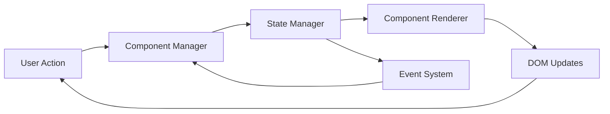
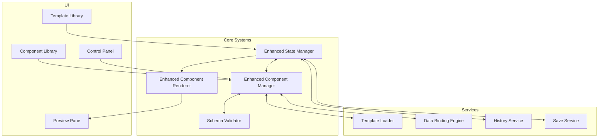
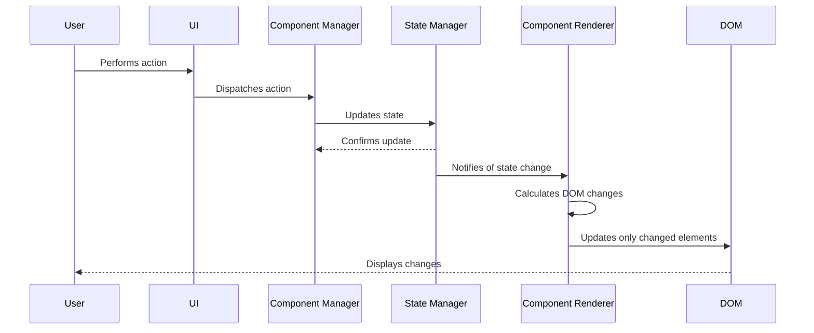
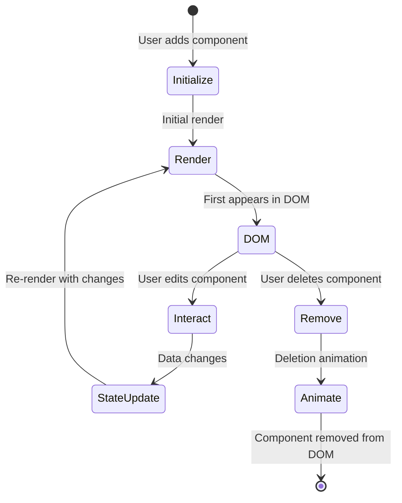

# Media Kit Builder Architecture

## Table of Contents

1. [Introduction](#introduction)
2. [Core Architecture](#core-architecture)
3. [State Management](#state-management)
4. [Component System](#component-system)
5. [Performance Optimizations](#performance-optimizations)
6. [Extension Points](#extension-points)
7. [Development Workflow](#development-workflow)

## Introduction

The Media Kit Builder is a powerful, flexible system for creating professional media kits through a modular component-based approach. This document outlines the architecture, design patterns, and key concepts that drive the system.

### Purpose

The Media Kit Builder enables users to:
- Create customized media kits from a library of components
- Save, edit, and share their media kits
- Export media kits in various formats
- Extend the system with custom components

### Key Architectural Principles

1. **State-First Design**: All updates flow through a centralized state manager
2. **Schema-Driven Components**: Components are defined by JSON schemas
3. **Separation of Concerns**: Clear boundaries between state, rendering, and UI
4. **Optimized Rendering**: Efficient DOM updates through diffing and caching
5. **Progressive Enhancement**: Feature flags for gradual migration and testing

### High-Level System Overview

The Media Kit Builder follows a unidirectional data flow pattern similar to Redux/Flux:



## Core Architecture

### System Components and Relationships

The Media Kit Builder consists of several core systems working together:



### Data Flow Patterns

The system follows a unidirectional data flow pattern:

1. **User Action**: A user interacts with the UI (adds component, changes setting, etc.)
2. **Action Dispatch**: The interaction is converted to an action and dispatched to the Component Manager
3. **State Update**: The Component Manager works with the State Manager to update the application state
4. **State Notification**: The State Manager notifies subscribers of the state change
5. **Rendering**: The Component Renderer receives the state update and efficiently updates the DOM
6. **UI Update**: The user sees the changes reflected in the interface



## State Management

The State Manager is the central source of truth for the application, managing the entire state tree and providing controlled ways to update it.

### State Structure

```javascript
// Example state structure
{
  components: {
    "hero-12345": {
      type: "hero",
      data: {
        title: "Jane Smith",
        subtitle: "Professional Photographer",
        backgroundImage: "url/to/image.jpg"
      },
      order: 0,
      meta: {
        isDeleting: false,
        isMoving: false
      }
    },
    "biography-67890": {
      type: "biography",
      data: {
        text: "Jane is an award-winning photographer...",
        photo: "url/to/profile.jpg"
      },
      order: 1,
      meta: {
        isDeleting: false,
        isMoving: false
      }
    }
  },
  metadata: {
    title: "Jane's Media Kit",
    theme: "default",
    lastModified: "2023-06-15T14:22:31.869Z"
  }
}
```

### State Update Mechanisms

The Enhanced State Manager provides several methods for updating state:

```javascript
// Initialize a new component
enhancedStateManager.initComponent(componentId, componentType, initialData);

// Update component data
enhancedStateManager.updateComponent(componentId, 'title', 'New Title');

// Batch updates for performance
await enhancedStateManager.batchUpdate(() => {
  enhancedStateManager.updateComponent(componentId, 'title', 'New Title');
  enhancedStateManager.updateComponent(componentId, 'subtitle', 'New Subtitle');
});

// Remove a component
enhancedStateManager.removeComponent(componentId);

// Reorder components
enhancedStateManager.reorderComponents(['component-1', 'component-2']);
```

### Event System

The state manager uses a subscription-based event system:

```javascript
// Subscribe to changes for a specific component
const unsubscribe = enhancedStateManager.subscribe(componentId, (data) => {
  console.log('Component data changed:', data);
});

// Subscribe to all state changes
const globalUnsubscribe = enhancedStateManager.subscribeGlobal((state) => {
  console.log('State changed:', state);
});

// Later, unsubscribe when no longer needed
unsubscribe();
globalUnsubscribe();
```

## Component System

The component system is built around a schema-driven architecture that defines component behavior, appearance, and data requirements.

### Component Lifecycle



### Schema-Driven Architecture

Components are defined by JSON schemas that specify their settings, behavior, and appearance:

```json
{
  "name": "hero",
  "label": "Hero Section",
  "description": "A full-width hero section with title, subtitle, and background image",
  "category": "Layout",
  "settings": {
    "title": {
      "type": "text",
      "label": "Title",
      "default": "Your Name",
      "description": "Main heading displayed in the hero",
      "required": true
    },
    "subtitle": {
      "type": "text",
      "label": "Subtitle",
      "default": "Your Profession",
      "description": "Secondary text displayed below the title"
    },
    "backgroundImage": {
      "type": "image",
      "label": "Background Image",
      "default": "",
      "description": "Full-width background image"
    },
    "textColor": {
      "type": "color",
      "label": "Text Color",
      "default": "#ffffff",
      "description": "Color of the title and subtitle text"
    },
    "alignment": {
      "type": "select",
      "label": "Text Alignment",
      "default": "center",
      "options": [
        {"value": "left", "label": "Left"},
        {"value": "center", "label": "Center"},
        {"value": "right", "label": "Right"}
      ]
    }
  },
  "template": "components/hero/template.php",
  "preview": "components/hero/preview.jpg",
  "version": "1.0.0"
}
```

### Component Rendering Process

The Enhanced Component Renderer uses an intelligent diffing algorithm to minimize DOM operations:

1. **Change Detection**: Compare new state with previous state
2. **Change Classification**: Identify components to add, update, remove, or reorder
3. **Batch Processing**: Group similar operations for efficiency
4. **Optimized DOM Updates**: Update only what changed
5. **Post-Update Animations**: Apply transition effects as needed

```javascript
// Example of the change detection process
calculateChanges(newState, oldState) {
  const changes = [];
  
  // Check for additions
  Object.keys(newState.components).forEach(id => {
    if (!oldState.components[id]) {
      changes.push({ type: 'add', id, component: newState.components[id] });
    } else {
      // Check for updates
      const newComp = newState.components[id];
      const oldComp = oldState.components[id];
      
      // Check if data changed
      if (JSON.stringify(newComp.data) !== JSON.stringify(oldComp.data)) {
        changes.push({ type: 'update', id, component: newComp, oldData: oldComp.data });
      }
      
      // Check if order changed
      if (newComp.order !== oldComp.order) {
        changes.push({ type: 'reorder', id, newOrder: newComp.order, oldOrder: oldComp.order });
      }
    }
  });
  
  // Check for removals
  Object.keys(oldState.components).forEach(id => {
    if (!newState.components[id]) {
      changes.push({ type: 'remove', id });
    }
  });
  
  return changes;
}
```

## Performance Optimizations

The Media Kit Builder includes several key optimizations to ensure smooth performance.

### Template Caching

Components are cached after first load to dramatically reduce rendering time:

```javascript
// Template caching implementation
const templateCache = new Map();
const cacheVersion = window.mediaKitData?.pluginVersion || '1.0.0';

async function renderComponent(componentType, props = {}) {
    const cacheKey = `${componentType}-${cacheVersion}`;
    
    // Check cache first
    if (templateCache.has(cacheKey)) {
        const template = templateCache.get(cacheKey);
        return hydrateTemplate(template, props);
    }
    
    // Fetch from server if not cached
    const html = await fetchTemplate(componentType);
    
    // Cache for future use
    templateCache.set(cacheKey, html);
    
    return hydrateTemplate(html, props);
}
```

### Batch Processing

State updates are batched to reduce render cycles:

```javascript
// Batch update implementation
async batchUpdate(updateFn) {
    // Pause notifications
    this.pauseNotifications = true;
    
    try {
        // Execute multiple updates
        await updateFn();
    } finally {
        // Resume notifications with a single update
        this.pauseNotifications = false;
        this.notifyGlobalListeners();
    }
}

// Usage example
await stateManager.batchUpdate(async () => {
    // Multiple state updates that will only trigger one render
    stateManager.updateComponent(id1, 'title', 'New Title');
    stateManager.updateComponent(id1, 'subtitle', 'New Subtitle');
    stateManager.updateComponent(id2, 'text', 'New Text');
});
```

### Rendering Optimizations

The renderer uses several strategies to optimize DOM updates:

1. **Diffing Algorithm**: Only update what changed in the DOM
2. **Animation Debouncing**: Prevent animation flickering
3. **Asynchronous Rendering**: Use `requestAnimationFrame` for smooth updates
4. **DOM Manipulation Batching**: Group DOM operations
5. **Health Checks**: Prevent render loops and stuck states

```javascript
// Example of batched DOM operations
async batchAdd(addChanges, fragment) {
    // Render all components in parallel
    const renderPromises = addChanges.map(async (change) => {
        const element = await this.addComponent(change.id, change.component);
        return { element, change };
    });
    
    const results = await Promise.all(renderPromises);
    
    // Sort by order and add to fragment
    const successful = results
        .filter(r => r.element)
        .sort((a, b) => a.change.component.order - b.change.component.order);
    
    // Single DOM update for all components
    successful.forEach(({ element }) => {
        fragment.appendChild(element);
    });
    
    // Append all at once to minimize reflows
    this.previewContainer.appendChild(fragment);
}
```

## Extension Points

The Media Kit Builder is designed to be extensible at multiple points.

### Custom Component Development

To create a custom component:

1. **Create Component Directory**: `components/my-component/`
2. **Define Component Schema**: `components/my-component/component.json`
3. **Create Template**: `components/my-component/template.php`
4. **Register with the Component Manager**: Add to the component registry

```json
// Example custom component schema
{
  "name": "custom-chart",
  "label": "Interactive Chart",
  "description": "Interactive data visualization component",
  "category": "Content",
  "settings": {
    "chartType": {
      "type": "select",
      "label": "Chart Type",
      "default": "bar",
      "options": [
        {"value": "bar", "label": "Bar Chart"},
        {"value": "line", "label": "Line Chart"},
        {"value": "pie", "label": "Pie Chart"}
      ]
    },
    "dataSource": {
      "type": "text",
      "label": "Data Source URL",
      "default": "",
      "description": "URL to JSON data source"
    }
  }
}
```

### Data Binding Engine Integration

The Data Binding Engine connects component settings to DOM elements:

```javascript
// Example data binding integration
dataBindingEngine.initializeComponent(componentId, componentType, schema);

// Add custom binding handler
dataBindingEngine.registerBindingHandler('chartUpdate', (element, value, options) => {
  // Custom rendering logic for charts
  initializeChart(element, value, options.chartType);
});

// Usage in component template
<div data-binding="chartUpdate" 
     data-binding-options='{"chartType": "bar"}'
     data-setting="dataSource">
</div>
```

### Schema Customization

Extend the schema validator for custom validation rules:

```javascript
// Add custom validation rule
schemaValidator.addValidationRule('isValidDataSource', (value) => {
  // Check if the value is a valid data source URL
  return value.startsWith('http') || value.startsWith('/api/');
});

// Apply custom validation in schema
{
  "dataSource": {
    "type": "text",
    "validation": ["isValidDataSource"],
    "errorMessage": "Please enter a valid data source URL"
  }
}
```

## Development Workflow

### Build Process

The Media Kit Builder uses a simple build process:

1. **Development**: Edit source files directly
2. **Testing**: Run automated tests with `npm test`
3. **Build**: Compile assets with `npm run build`
4. **Deployment**: Copy built files to production

### Testing Approach

The system uses Vitest for testing:

```javascript
// Example component test
import { enhancedComponentManager } from '../js/core/enhanced-component-manager.js';
import { enhancedStateManager } from '../js/core/enhanced-state-manager.js';

describe('Component Manager', () => {
  beforeEach(() => {
    enhancedStateManager.clearState();
  });
  
  test('should add a component', async () => {
    const componentId = await enhancedComponentManager.addComponent('hero');
    const component = enhancedStateManager.getComponent(componentId);
    
    expect(component).not.toBeNull();
    expect(component.type).toBe('hero');
  });
});
```

### Debugging Tools

The system includes built-in debugging tools:

```javascript
// Available in browser console
window.gmkbDebug = { 
    getState: () => window.stateManager?.getState(),
    getManagers: () => ({
        stateManager: window.stateManager,
        componentManager: window.componentManager,
        componentRenderer: window.componentRenderer,
        historyService: window.historyService,
    }),
    checkEnhanced: () => ({
        usingEnhancedState: window.stateManager === window.enhancedStateManager,
        usingEnhancedComponent: window.componentManager === window.enhancedComponentManager,
        usingEnhancedRenderer: window.componentRenderer === window.enhancedComponentRenderer
    })
};

// Performance monitoring
window.mkPerf.report(); // Shows performance metrics
```

## Conclusion

The Media Kit Builder architecture provides a robust, performant foundation for creating media kits. By following clear separation of concerns, unidirectional data flow, and schema-driven development, the system remains maintainable while delivering excellent user experience.

For more information on developing components, see the [Component Development Guide](COMPONENTS.md).
